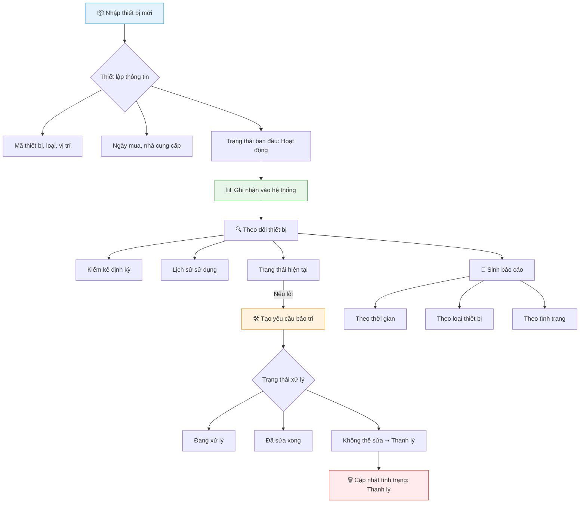
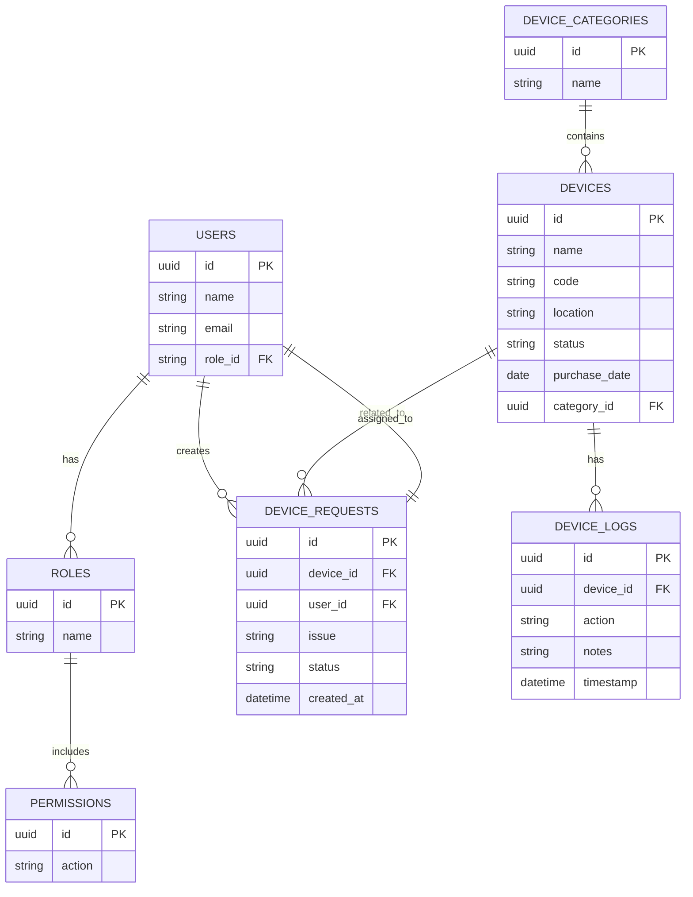

# Main Flow theo 6 chiếc mũ tư duy

## I. luồng quản lý trang thiết bị trong phòng khám  

```mermaid
flowchart TD
    A[📦 Nhập thiết bị mới] --> B{Thiết lập thông tin}
    B --> B1[Mã thiết bị, loại, vị trí]
    B --> B2[Ngày mua, nhà cung cấp]
    B --> B3[Trạng thái ban đầu: Hoạt động]

    B3 --> C[📊 Ghi nhận vào hệ thống]

    C --> D[🔍 Theo dõi thiết bị]
    D --> D1[Kiểm kê định kỳ]
    D --> D2[Lịch sử sử dụng]
    D --> D3[Trạng thái hiện tại]

    D3 -->|Nếu lỗi| E[🛠️ Tạo yêu cầu bảo trì]
    E --> F{Trạng thái xử lý}
    F --> F1[Đang xử lý]
    F --> F2[Đã sửa xong]
    F --> F3[Không thể sửa ➝ Thanh lý]

    F3 --> G[🗑️ Cập nhật tình trạng: Thanh lý]

    D --> H[📄 Sinh báo cáo]
    H --> H1[Theo thời gian]
    H --> H2[Theo loại thiết bị]
    H --> H3[Theo tình trạng]

    style A fill:#E3F2FD,stroke:#2196F3
    style C fill:#E8F5E9,stroke:#4CAF50
    style E fill:#FFF3E0,stroke:#FF9800
    style G fill:#FFEBEE,stroke:#F44336
```

## II. Vai trò và hành vi của người dùng

```mermaid
flowchart TD
    Admin[👤 Admin] --> A1[Tạo / chỉnh sửa thiết bị]
    Admin --> A2[Phân quyền người dùng]
    Admin --> A3[Xem và xuất báo cáo tổng hợp]

    Technician[🔧 Kỹ thuật viên] --> T1[Tiếp nhận yêu cầu bảo trì]
    Technician --> T2[Cập nhật trạng thái thiết bị]
    Technician --> T3[Ghi nhận lịch sử sửa chữa]

    Doctor[🩺 Bác sĩ / Điều dưỡng] --> D1[Tra cứu thiết bị theo phòng]
    Doctor --> D2[Gửi yêu cầu sửa thiết bị lỗi]

    AllUsers[👥 Tất cả người dùng] --> U1[Quét mã QR để xem thông tin thiết bị]
    AllUsers --> U2[Xem trạng thái hoạt động thiết bị]

    style Admin fill:#E3F2FD,stroke:#1E88E5
    style Technician fill:#F1F8E9,stroke:#8BC34A
    style Doctor fill:#FCE4EC,stroke:#EC407A
    style AllUsers fill:#F3E5F5,stroke:#9C27B0
```

## III. Sơ đồ dữ liệu ERD

```mermaid
erDiagram
    USERS ||--o{ ROLES : has
    USERS ||--o{ DEVICE_REQUESTS : creates
    ROLES ||--o{ PERMISSIONS : includes
    DEVICES ||--o{ DEVICE_LOGS : has
    DEVICES ||--o{ DEVICE_REQUESTS : related_to
    DEVICE_REQUESTS ||--|| USERS : assigned_to
    DEVICE_CATEGORIES ||--o{ DEVICES : contains

    USERS {
        uuid id PK
        string name
        string email
        string role_id FK
    }

    ROLES {
        uuid id PK
        string name
    }

    PERMISSIONS {
        uuid id PK
        string action
    }

    DEVICES {
        uuid id PK
        string name
        string code
        string location
        string status
        date purchase_date
        uuid category_id FK
    }

    DEVICE_LOGS {
        uuid id PK
        uuid device_id FK
        string action
        string notes
        datetime timestamp
    }

    DEVICE_REQUESTS {
        uuid id PK
        uuid device_id FK
        uuid user_id FK
        string issue
        string status
        datetime created_at
    }

    DEVICE_CATEGORIES {
        uuid id PK
        string name
    }
```

