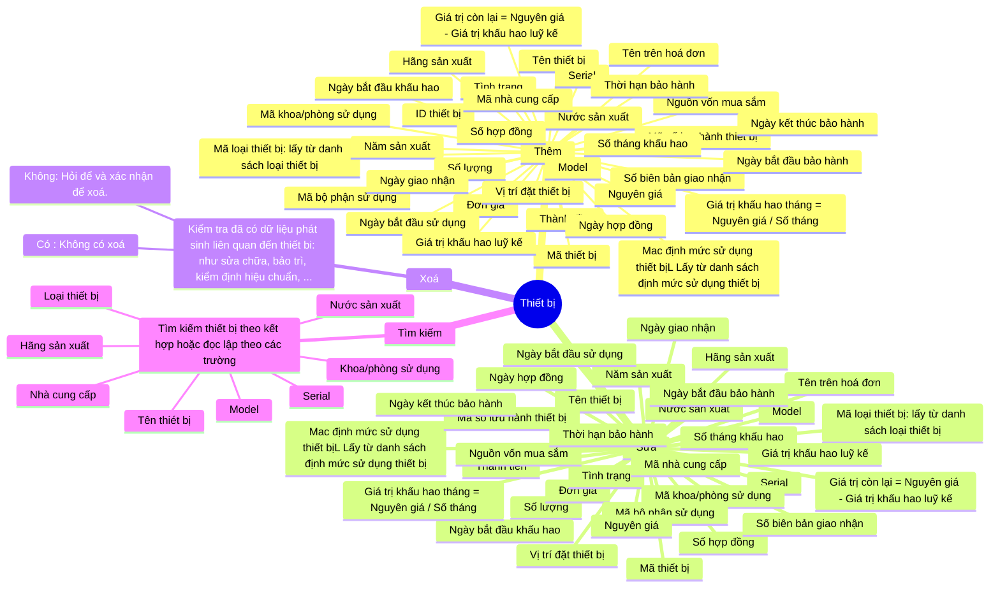

```mermaid
mindmap
  root((Thiết bị))
      Thêm
        ID thiết bị
        Mã thiết bị
        Tên thiết bị
        Tên trên hoá đơn
        Mã loại thiết bị: lấy từ danh sách loại thiết bị
        Mac định mức sử dụng thiết bịL Lấy từ danh sách định mức sử dụng thiết bị
        Hãng sản xuất
        Nước sản xuất
        Năm sản xuất
        Model
        Serial
        Số lượng
        Đơn giá
        Thành tiền
        Tình trạng
        Mã khoa/phòng sử dụng
        Mã bộ phận sử dụng
        Ngày bắt đầu sử dụng
        Vị trí đặt thiết bị
        Mã số lưu hành thiết bị
        Mã nhà cung cấp
        Số hợp đồng
        Ngày hợp đồng
        Số biên bản giao nhận
        Ngày giao nhận
        Nguồn vốn mua sắm
        Thời hạn bảo hành
        Ngày bắt đầu bảo hành
        Ngày kết thúc bảo hành
        Nguyên giá
        Số tháng khấu hao
        Ngày bắt đầu khấu hao
        Giá trị khấu hao tháng = Nguyên giá / Số tháng
        Giá trị khấu hao luỹ kế
        Giá trị còn lại = Nguyên giá - Giá trị khấu hao luỹ kế
    Sửa
        Mã thiết bị
        Tên thiết bị
        Tên trên hoá đơn
        Mã loại thiết bị: lấy từ danh sách loại thiết bị
        Mac định mức sử dụng thiết bịL Lấy từ danh sách định mức sử dụng thiết bị
        Hãng sản xuất
        Nước sản xuất
        Năm sản xuất
        Model
        Serial
        Số lượng
        Đơn giá
        Thành tiền
        Tình trạng
        Mã khoa/phòng sử dụng
        Mã bộ phận sử dụng
        Ngày bắt đầu sử dụng
        Vị trí đặt thiết bị
        Mã số lưu hành thiết bị
        Mã nhà cung cấp
        Số hợp đồng
        Ngày hợp đồng
        Số biên bản giao nhận
        Ngày giao nhận
        Nguồn vốn mua sắm
        Thời hạn bảo hành
        Ngày bắt đầu bảo hành
        Ngày kết thúc bảo hành
        Nguyên giá
        Số tháng khấu hao
        Ngày bắt đầu khấu hao
        Giá trị khấu hao tháng = Nguyên giá / Số tháng
        Giá trị khấu hao luỹ kế
        Giá trị còn lại = Nguyên giá - Giá trị khấu hao luỹ kế
    Xoá
      Kiểm tra đã có dữ liệu phát sinh liên quan đến thiết bi: như sửa chữa, bảo trì, kiểm định hiệu chuẩn, ...
        Có : Không có xoá
        Không: Hỏi để và xác nhận để xoá.
    Tìm kiếm
      Tìm kiếm thiết bị theo kết hợp hoặc đọc lập theo các trường
        Tên thiét bị
        Loại thiết bị 
        Model
        Serial
        Hãng sản xuất
        Nước sản xuất
        Khoa/phòng sử dụng
        Nhà cung cấp
```
