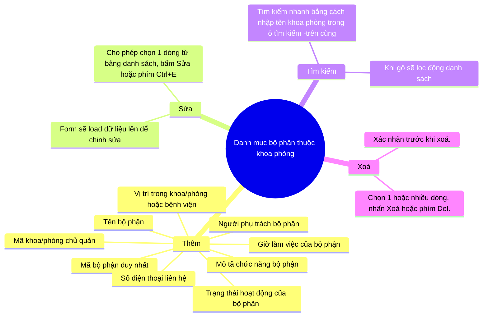

```mermaid
mindmap
  root((Danh mục bộ phận thuộc khoa phòng))
     
        Thêm
          Mã bộ phận duy nhất
          Tên bộ phận
          Mã khoa/phòng chủ quản
          Mô tả chức năng bộ phận
          Người phụ trách bộ phận
          Số điện thoại liên hệ
          Vị trí trong khoa/phòng hoặc bệnh viện
          Giờ làm việc của bộ phận
          Trạng thái hoạt động của bộ phận 
        Sửa
          Cho phép chọn 1 dòng từ bảng danh sách, bấm Sửa hoặc phím Ctrl+E
          Form sẽ load dữ liệu lên để chỉnh sửa
        Tìm kiếm
          Tìm kiếm nhanh bằng cách nhập tên khoa phòng trong ô tìm kiếm -trên cùng
          Khi gõ sẽ lọc động danh sách
        Xoá
          Chọn 1 hoặc nhiều dòng, nhấn Xoá hoặc phím Del.
          Xác nhận trước khi xoá.
   

```
