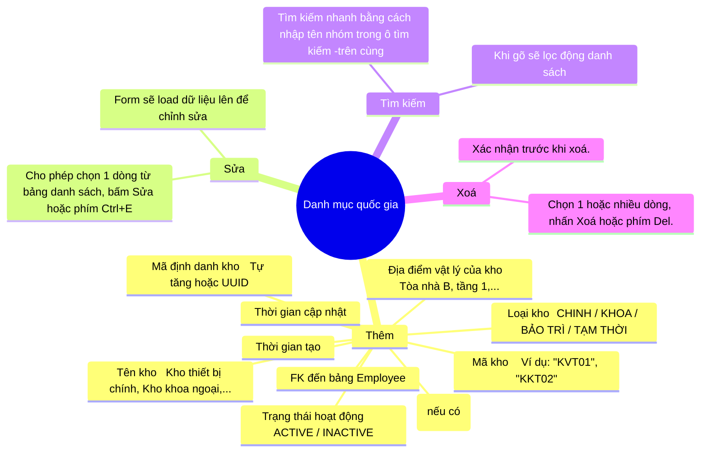

```mermaid
mindmap
  root((Danh mục quốc gia))
     
        Thêm
          Mã định danh kho	Tự tăng hoặc UUID
          Mã kho	Ví dụ: "KVT01", "KKT02"
          Tên kho	Kho thiết bị chính, Kho khoa ngoại,...
          Loại kho	CHINH / KHOA / BẢO TRÌ / TẠM THỜI
          Địa điểm vật lý của kho	Tòa nhà B, tầng 1,...
          FK đến bảng Employee	
          Số điện thoại kho (nếu có)	
          Trạng thái hoạt động	ACTIVE / INACTIVE
          Thời gian tạo	
          Thời gian cập nhật	
        Sửa
          Cho phép chọn 1 dòng từ bảng danh sách, bấm Sửa hoặc phím Ctrl+E
          Form sẽ load dữ liệu lên để chỉnh sửa
        Tìm kiếm
          Tìm kiếm nhanh bằng cách nhập tên nhóm trong ô tìm kiếm -trên cùng
          Khi gõ sẽ lọc động danh sách
        Xoá
          Chọn 1 hoặc nhiều dòng, nhấn Xoá hoặc phím Del.
          Xác nhận trước khi xoá.
   

```
