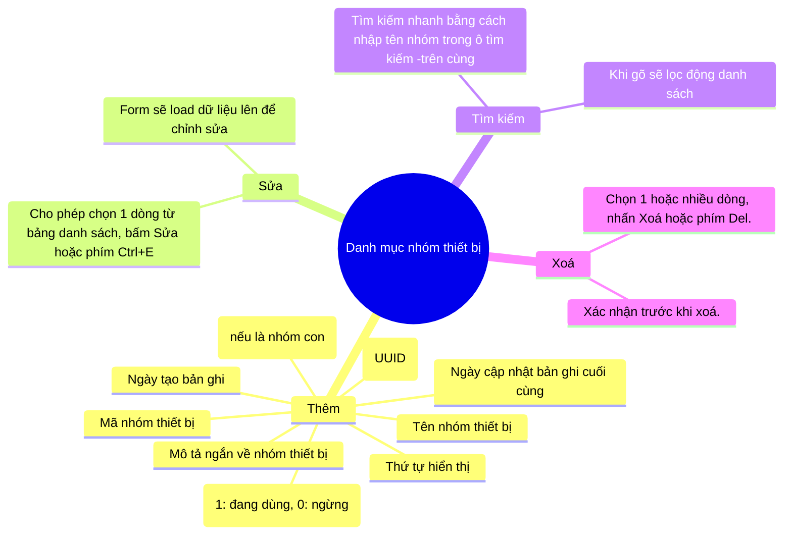

```mermaid
mindmap
  root((Danh mục nhóm thiết bị))
     
        Thêm
          Mã định danh nhóm thiết bị (UUID)
          Mã nhóm thiết bị
          Tên nhóm thiết bị
          Mô tả ngắn về nhóm thiết bị
          ID nhóm cha (nếu là nhóm con)
          Thứ tự hiển thị
          Trạng thái hoạt động (1: đang dùng, 0: ngừng)
          Ngày tạo bản ghi
          Ngày cập nhật bản ghi cuối cùng
        Sửa
          Cho phép chọn 1 dòng từ bảng danh sách, bấm Sửa hoặc phím Ctrl+E
          Form sẽ load dữ liệu lên để chỉnh sửa
        Tìm kiếm
          Tìm kiếm nhanh bằng cách nhập tên nhóm trong ô tìm kiếm -trên cùng
          Khi gõ sẽ lọc động danh sách
        Xoá
          Chọn 1 hoặc nhiều dòng, nhấn Xoá hoặc phím Del.
          Xác nhận trước khi xoá.
   

```
