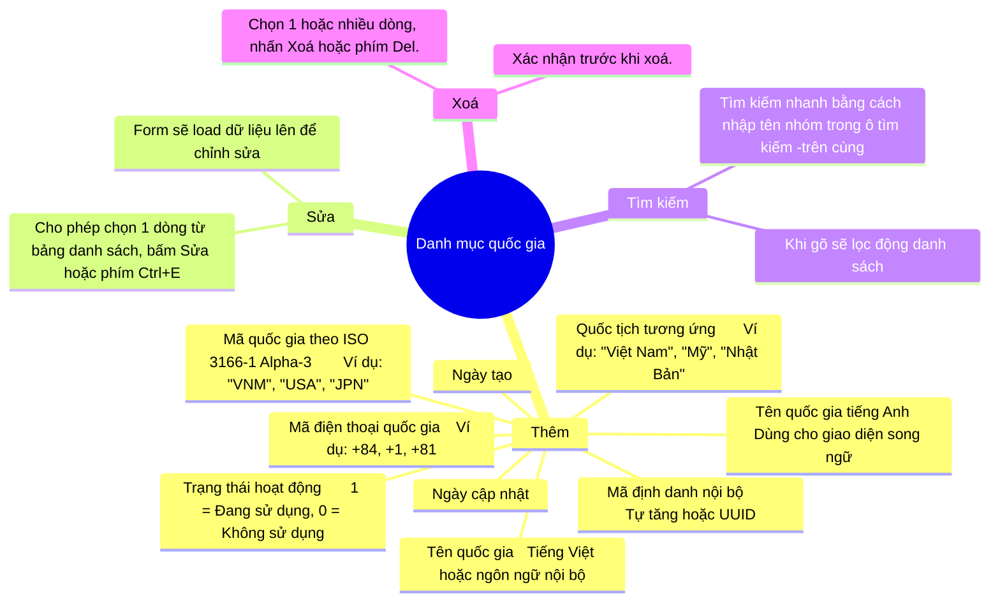

```mermaid
mindmap
  root((Danh mục quốc gia))
     
        Thêm
          Mã định danh nội bộ	Tự tăng hoặc UUID
          Mã quốc gia theo ISO 3166-1 Alpha-3	Ví dụ: "VNM", "USA", "JPN"
          Tên quốc gia	Tiếng Việt hoặc ngôn ngữ nội bộ
          Tên quốc gia tiếng Anh	Dùng cho giao diện song ngữ
          Mã điện thoại quốc gia	Ví dụ: +84, +1, +81
          Quốc tịch tương ứng	Ví dụ: "Việt Nam", "Mỹ", "Nhật Bản"
          Trạng thái hoạt động	1 = Đang sử dụng, 0 = Không sử dụng
          Ngày tạo	
          Ngày cập nhật	
        Sửa
          Cho phép chọn 1 dòng từ bảng danh sách, bấm Sửa hoặc phím Ctrl+E
          Form sẽ load dữ liệu lên để chỉnh sửa
        Tìm kiếm
          Tìm kiếm nhanh bằng cách nhập tên nhóm trong ô tìm kiếm -trên cùng
          Khi gõ sẽ lọc động danh sách
        Xoá
          Chọn 1 hoặc nhiều dòng, nhấn Xoá hoặc phím Del.
          Xác nhận trước khi xoá.
   

```
