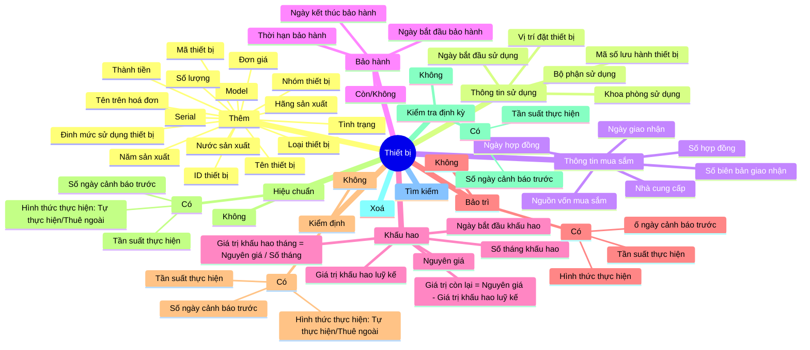

```mermaid
mindmap
  root((Thiết bị))
      Thêm
        ID thiết bị
        Mã thiết bị
        Tên thiết bị
        Tên trên hoá đơn
        Loại thiết bị
        Nhóm thiết bị
        Đinh mức sử dụng thiết bị
        Hãng sản xuất
        Nước sản xuất
        Năm sản xuất
        Model
        Serial
        Số lượng
        Đơn giá
        Thành tiền
        Tình trạng
    Thông tin sử dụng
        Khoa phòng sử dụng
        Bộ phận sử dụng
        Ngày bắt đầu sử dụng
        Vị trí đặt thiết bị
        Mã số lưu hành thiết bị
    Thông tin mua sắm
        Nhà cung cấp
        Số hợp đồng
        Ngày hợp đồng
        Số biên bản giao nhận
        Ngày giao nhận
        Nguồn vốn mua sắm
    Bảo hành
        Còn/Không
        Thời hạn bảo hành
        Ngày bắt đầu bảo hành
        Ngày kết thúc bảo hành
    Khấu hao
        Nguyên giá
        Số tháng khấu hao
        Ngày bắt đầu khấu hao
        Giá trị khấu hao tháng = Nguyên giá / Số tháng
        Giá trị khấu hao luỹ kế
        Giá trị còn lại = Nguyên giá - Giá trị khấu hao luỹ kế
    Bảo trì
        Không
        Có 
          Hình thức thực hiện
          Tần suất thực hiện
          ố ngày cảnh báo trước
    Kiểm định
        Không
        Có
          Hình thức thực hiện: Tự thực hiện/Thuê ngoài
          Tần suất thực hiện
          Số ngày cảnh báo trước
    Hiệu chuẩn
        Không
        Có
          Hình thức thực hiện: Tự thực hiện/Thuê ngoài
          Tần suất thực hiện
          Số ngày cảnh báo trước
    Kiểm tra định kỳ
          Không
          Có
            Tần suất thực hiện
            Số ngày cảnh báo trước
    Xoá
    Tìm kiếm
      
```
