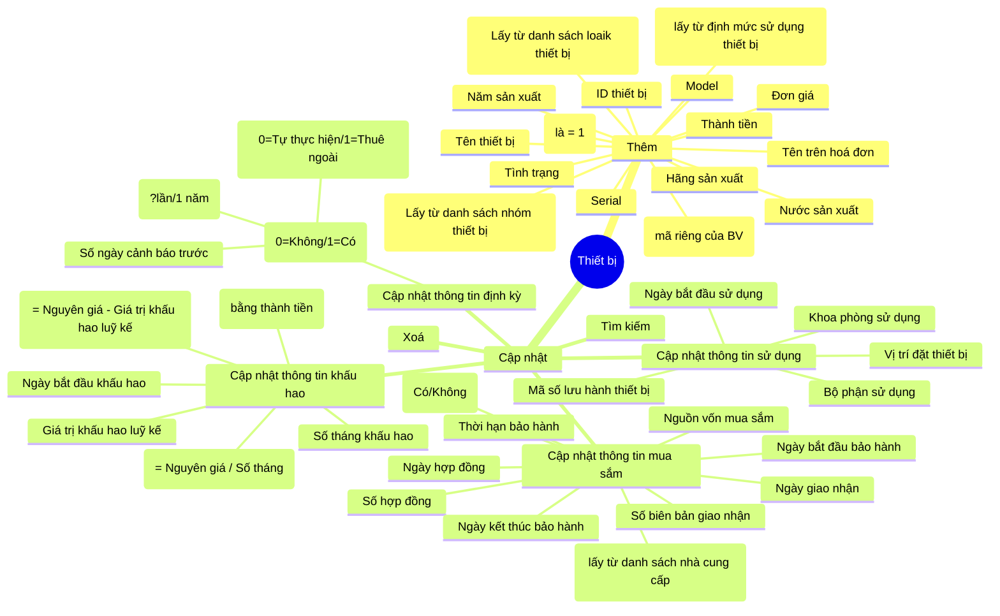

```mermaid
mindmap
  root((Thiết bị))
      Thêm
        ID thiết bị
        Mã thiết bị (mã riêng của BV)
        Tên thiết bị
        Tên trên hoá đơn
        Loại thiết bị (Lấy từ danh sách loaik thiết bị)
        Nhóm thiết bị (Lấy từ danh sách nhóm thiết bị)
        Đinh mức sử dụng thiết bị (lấy từ định mức sử dụng thiết bị)
        Hãng sản xuất
        Nước sản xuất
        Năm sản xuất
        Model
        Serial
        Số lượng (là = 1)
        Đơn giá
        Thành tiền
        Tình trạng
    Cập nhật
      Cập nhật thông tin sử dụng
        Khoa phòng sử dụng
        Bộ phận sử dụng
        Ngày bắt đầu sử dụng
        Vị trí đặt thiết bị
        Mã số lưu hành thiết bị
      Cập nhật thông tin mua sắm
        Nhà cung cấp (lấy từ danh sách nhà cung cấp)
        Số hợp đồng
        Ngày hợp đồng
        Số biên bản giao nhận
        Ngày giao nhận
        Nguồn vốn mua sắm
        Bảo hành (Có/Không)
        Thời hạn bảo hành
        Ngày bắt đầu bảo hành
        Ngày kết thúc bảo hành
      Cập nhật thông tin khấu hao
        Nguyên giá (bằng thành tiền)
        Số tháng khấu hao
        Ngày bắt đầu khấu hao
        Giá trị khấu hao tháng (= Nguyên giá / Số tháng)
        Giá trị khấu hao luỹ kế
        Giá trị còn lại (= Nguyên giá - Giá trị khấu hao luỹ kế)
      Cập nhật thông tin định kỳ
        Bảo trì (0=Không/1=Có)
          Hình thức thực hiện (0=Tự thực hiện/1=Thuê ngoài)
          Tần suất thực hiện (?lần/1 năm)
          Số ngày cảnh báo trước
      Xoá
        
      Tìm kiếm
      
```
