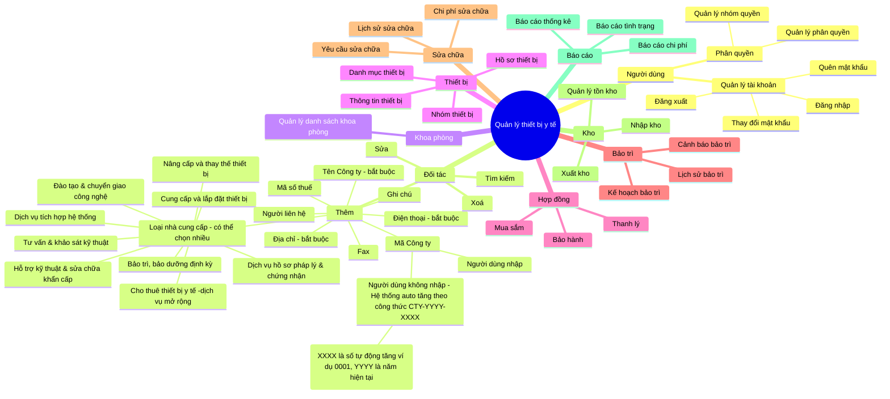

```mermaid
mindmap
  root((Quản lý thiết bị y tế))
    Người dùng
      Quản lý tài khoản
         Đăng nhập
         Đăng xuất
         Thay đổi mật khẩu
         Quên mật khẩu
      Phân quyền
         Quản lý nhóm quyền
         Quản lý phân quyền

    Đối tác
        Thêm
          Mã Công ty 
               Người dùng nhập 
               Người dùng không nhập - Hệ thống auto tăng theo công thức CTY-YYYY-XXXX
                   (XXXX là số tự động tăng ví dụ 0001, YYYY là năm hiện tại)
          Tên Công ty - bắt buộc
          Mã số thuế
          Loại nhà cung cấp - có thể chọn nhiều
               Tư vấn & khảo sát kỹ thuật
               Cung cấp và lắp đặt thiết bị
               Đào tạo & chuyển giao công nghệ
               Bảo trì, bảo dưỡng định kỳ
               Hỗ trợ kỹ thuật & sửa chữa khẩn cấp
               Dịch vụ hồ sơ pháp lý & chứng nhận
               Nâng cấp và thay thế thiết bị
               Cho thuê thiết bị y tế -dịch vụ mở rộng
               Dịch vụ tích hợp hệ thống                    
         Địa chỉ - bắt buộc
         Người liên hệ
         Điện thoại - bắt buộc
         Fax
         Ghi chú  
        Sửa
        Xoá
        Tìm kiếm
    Khoa phòng
      Quản lý danh sách khoa phòng
      
    Thiết bị
      Nhóm thiết bị
      Danh mục thiết bị
      Thông tin thiết bị
      Hồ sơ thiết bị

    Hợp đồng
      Mua sắm
      Bảo hành
      Thanh lý
    Bảo trì
      Kế hoạch bảo trì
      Lịch sử bảo trì
      Cảnh báo bảo trì
    Sửa chữa
      Yêu cầu sửa chữa
      Lịch sử sửa chữa
      Chi phí sửa chữa
    Kho
      Quản lý tồn kho
      Nhập kho
      Xuất kho
    Báo cáo
      Báo cáo thống kê
      Báo cáo tình trạng
      Báo cáo chi phí
   

```
