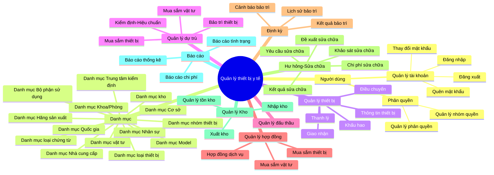

```mermaid
mindmap
  root((Quản lý thiết bị y tế))
    Người dùng
      Quản lý tài khoản
         Đăng nhập
         Đăng xuất
         Thay đổi mật khẩu
         Quên mật khẩu
         
      Phân quyền
         Quản lý nhóm quyền
         Quản lý phân quyền

    Danh mục
      Danh mục Cơ sở
      Danh mục Khoa/Phòng
      Danh mục Bộ phận sử dụng 
      Danh mục Nhân sự
      Danh mục Quốc gia
      Danh mục Hãng sản xuất
      Danh mục Model
      Danh mục kho
      Danh mục Nhà cung cấp
      Danh mục Trung tâm kiểm định
      Danh mục nhóm thiết bị
      Danh mục loại thiết bị
      Danh mục vật tư
      Danh mục loại chứng từ

    Quản lý thiết bị
      Thông tin thiết bị
      Giao nhận
      Điều chuyển
      Khấu hao
      Thanh lý

    Quản lý dự trù
      Mua sắm thiết bị
      Mua sắm vật tư
      Bảo trì thiết bị
      Kiểm định-Hiệu chuẩn

    Quản lý đấu thầu

    Quản lý hợp đồng
      Mua sắm thiết bị
      Mua sắm vật tư
      Hợp đồng dịch vụ
      
    Định kỳ
      Kết quả bảo trì
      Lịch sử bảo trì
      Cảnh báo bảo trì

    Hư hỏng-Sửa chữa
      Yêu cầu sửa chữa
      Khảo sát sửa chữa
      Đề xuất sửa chữa
      Kết quả sửa chữa
      Chi phí sửa chữa

    Quản lý Kho
      Quản lý tồn kho
      Nhập kho
      Xuất kho

    Báo cáo
      Báo cáo thống kê
      Báo cáo tình trạng
      Báo cáo chi phí
   

```
